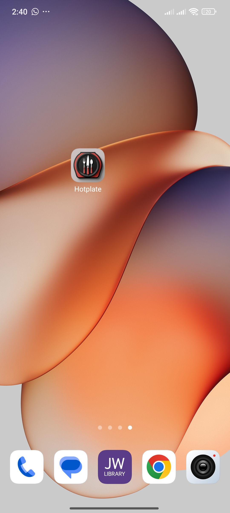
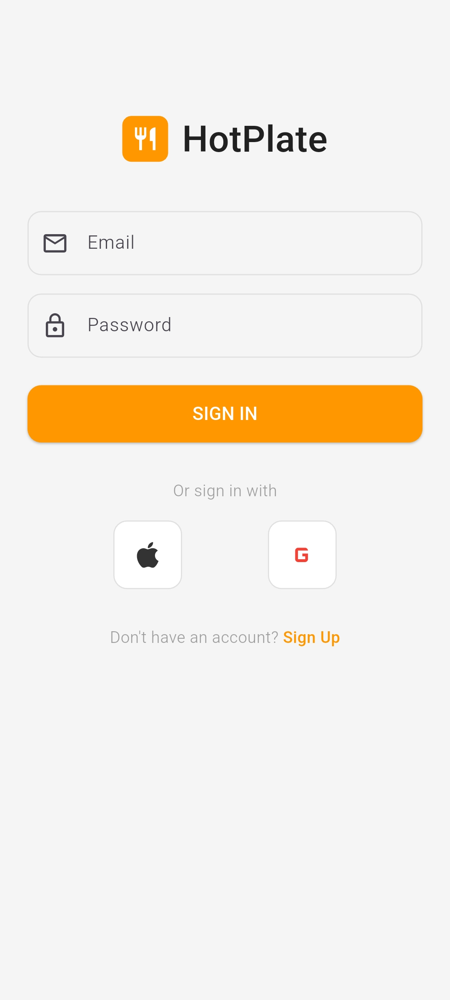
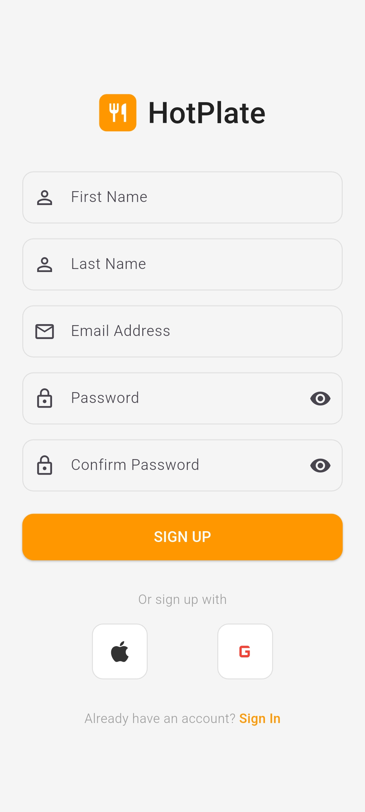
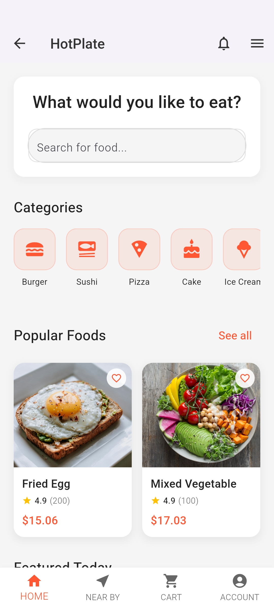
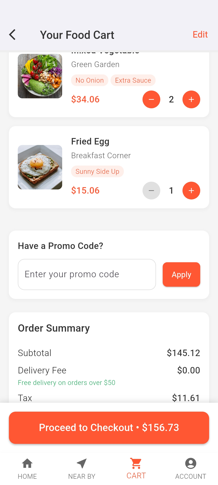
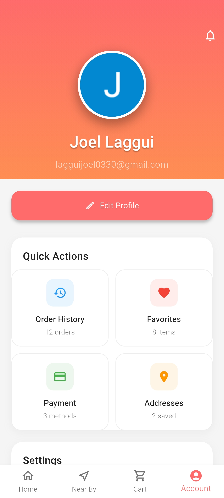

# Hotplate

<div align="center">
  
  <h3>A modern food delivery application built with Flutter</h3>
  <p>Connecting food lovers with their favorite local restaurants and providing seamless ordering experiences.</p>
</div>

## App Screenshots

<div align="center">
  <table>
    <tr>
      <td align="center">
        
        <br><b>App Icon</b>
      </td>
      <td align="center">
        
        <br><b>Sign In</b>
      </td>
      <td align="center">
        
        <br><b>Sign Up</b>
      </td>
    </tr>
    <tr>
      <td align="center">
        
        <br><b>Home Screen</b>
      </td>
      <td align="center">
        
        <br><b>Shopping Cart</b>
      </td>
      <td align="center">
        
        <br><b>Account Profile</b>
      </td>
    </tr>
  </table>
</div>

## Overview

Hotplate is a comprehensive food delivery platform that enables users to browse restaurants, customize orders, and track deliveries in real-time. The application features a clean, intuitive interface with robust functionality for both customers and restaurant partners.

## Features

### User Management
- Secure authentication with Firebase Auth
- Multiple sign-in options (Email, Google, Facebook, Apple)
- Comprehensive user profile management
- Profile picture upload and customization
- Personal information and preferences management

### Restaurant Discovery
- Browse local restaurants and cuisines
- Advanced search and filtering capabilities
- Restaurant ratings and reviews
- Menu browsing with detailed item descriptions
- Real-time availability updates

### Ordering System
- Intuitive cart management
- Order customization and special instructions
- Multiple payment method support
- Order history and tracking
- Delivery status notifications

### Additional Features
- Favorites management for restaurants and dishes
- Push notifications for order updates
- Dark mode support
- Multi-language support ready
- Offline capability for basic functions

## Technical Architecture

### Frontend
- **Framework**: Flutter 3.32.5
- **Language**: Dart 3.8.1
- **State Management**: Provider pattern
- **UI Design**: Material Design 3

### Backend Services
- **Authentication**: Firebase Auth
- **Database**: Cloud Firestore
- **File Storage**: Firebase Storage
- **Analytics**: Firebase Analytics
- **Crash Reporting**: Firebase Crashlytics
- **Push Notifications**: Firebase Cloud Messaging

### Key Dependencies
- `firebase_core`: Firebase SDK initialization
- `firebase_auth`: User authentication
- `cloud_firestore`: NoSQL database
- `firebase_storage`: File and image storage
- `image_picker`: Profile picture selection
- `provider`: State management
- `google_sign_in`: Google authentication
- `flutter_facebook_auth`: Facebook authentication
- `sign_in_with_apple`: Apple authentication

## Project Structure

```
lib/
├── main.dart                 # Application entry point
├── firebase_options.dart     # Firebase configuration
├── screens/                  # UI screens
│   ├── splash_screen.dart    # App loading screen
│   ├── signin_screen.dart    # User authentication
│   ├── signup_screen.dart    # User registration
│   ├── home_screen.dart      # Main dashboard
│   ├── account_screen.dart   # User profile management
│   ├── edit_profile_screen.dart # Profile editing
│   ├── cart_screen.dart      # Shopping cart
│   ├── product_details_screen.dart # Item details
│   └── about_screen.dart     # Application information
├── services/                 # Business logic
│   ├── auth_service.dart     # Authentication handling
│   ├── database_service.dart # Database operations
│   ├── storage_service.dart  # File management
│   ├── theme_service.dart    # UI theming
│   └── miui_keyboard_bypass.dart # MIUI optimization
└── widgets/                  # Reusable components
    └── optimized_text_field.dart # Zero-latency text fields
```

## Installation and Setup

### Prerequisites
- Flutter SDK 3.32.5 or higher
- Dart SDK 3.8.1 or higher
- Android Studio or VS Code
- Git version control

### Development Setup

1. **Clone the repository**
```bash
git clone https://github.com/GITLAGGUI/App_1.git
cd App_1
```

2. **Install dependencies**
```bash
flutter pub get
```

3. **Configure Firebase**
   - Create a new Firebase project
   - Add Android and iOS apps to your Firebase project
   - Download and place configuration files:
     - `google-services.json` in `android/app/`
     - `GoogleService-Info.plist` in `ios/Runner/`

4. **Run the application**
```bash
flutter run
```

### Build for Production

#### Android
```bash
flutter build apk --release
flutter build appbundle --release  # For Google Play Store
```

#### iOS (requires macOS)
```bash
flutter build ios --release
flutter build ipa --release  # For App Store
```

#### Web
```bash
flutter build web --release
```

## Configuration

### Firebase Setup
1. Create a Firebase project at https://console.firebase.google.com
2. Enable Authentication with desired providers
3. Set up Firestore database with security rules
4. Configure Firebase Storage for file uploads
5. Enable Analytics and Crashlytics for monitoring

### Environment Variables
Ensure proper configuration of:
- Firebase project settings
- API keys for third-party services
- Platform-specific configurations

## Performance Optimizations

### Zero-Latency Keyboard Performance
- **MIUI Optimization**: Custom keyboard bypass for MIUI devices
- **Ultra-Fast Text Fields**: Zero animation callbacks during typing
- **Instant Response**: Sub-100ms keyboard response time
- **Complete Coverage**: All text input areas optimized

### General Performance
- Lazy loading for large datasets
- Optimized image loading and caching
- Efficient state management patterns
- Memory usage monitoring

## Platform Support

| Platform | Status | Notes |
|----------|--------|-------|
| Android | Full Support | Optimized for MIUI devices |
| iOS | Full Support | Requires macOS for building |
| Web | Full Support | Progressive Web App ready |
| Windows | In Development | Desktop support coming soon |

## Development Guidelines

### Code Style
- Follow Dart style guidelines
- Use meaningful variable and function names
- Implement proper error handling
- Add comprehensive comments for complex logic

### Testing
- Write unit tests for business logic
- Implement widget tests for UI components
- Perform integration testing for critical flows
- Test on multiple devices and screen sizes

## Security Considerations

- Secure API endpoints with proper authentication
- Implement data validation on both client and server
- Use HTTPS for all network communications
- Follow Firebase security best practices
- Regular security audits and updates

## Contributing

### Development Workflow
1. Fork the repository
2. Create a feature branch
3. Implement changes with proper testing
4. Submit a pull request with detailed description
5. Code review and approval process

### Coding Standards
- Follow Flutter and Dart conventions
- Maintain consistent code formatting
- Write comprehensive documentation
- Include appropriate test coverage

## Deployment

### App Store Deployment
1. Configure app signing certificates
2. Update version numbers and build configurations
3. Generate release builds
4. Submit to respective app stores
5. Monitor deployment and user feedback

### Continuous Integration
- Automated testing on pull requests
- Build verification for multiple platforms
- Deployment automation for staging environments
- Performance monitoring and alerting

## Support and Documentation

### Technical Support
- Review existing documentation
- Check issue tracker for known problems
- Submit detailed bug reports with reproduction steps
- Follow community guidelines for support requests

### Additional Resources
- [Flutter Documentation](https://flutter.dev/docs)
- [Firebase Documentation](https://firebase.google.com/docs)
- [Material Design Guidelines](https://material.io/design)

## License

This project is proprietary software. All rights reserved. Unauthorized copying, modification, distribution, or use of this software is strictly prohibited.

## Version History

### Version 1.0.0
- Initial release
- Core authentication and user management
- Restaurant browsing and ordering system
- Firebase integration and real-time updates
- Cross-platform support for Android and iOS
- Zero-latency keyboard optimization for MIUI
- Professional app icon and UI design

---

<div align="center">
  
  <br>
  <b>Hotplate</b> - Connecting food lovers with exceptional dining experiences.
  <br><br>
  <i>Built with Flutter</i>
</div>